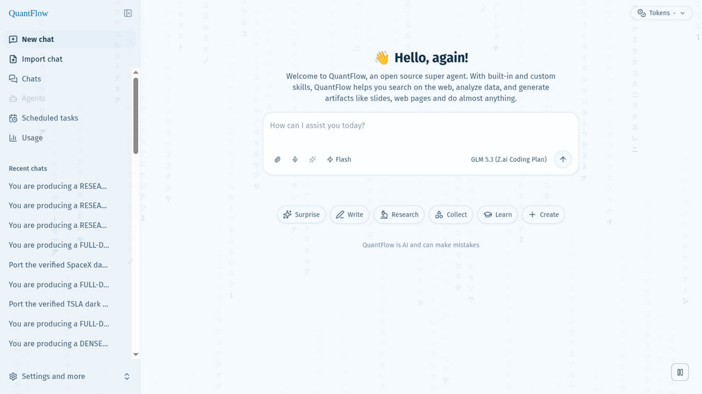
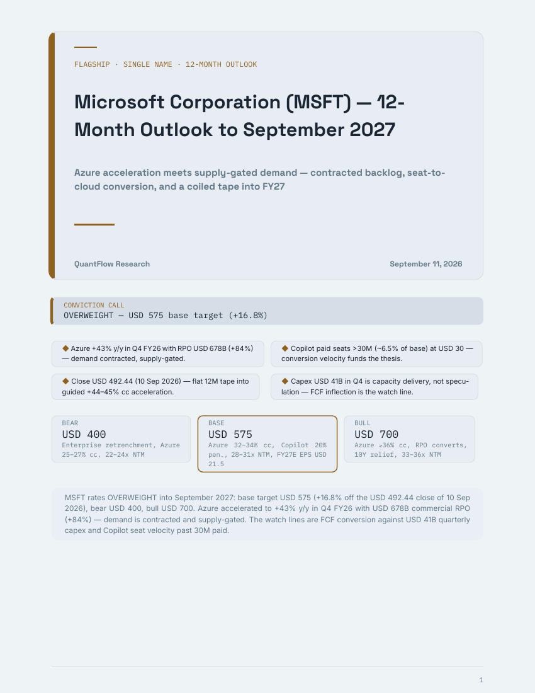
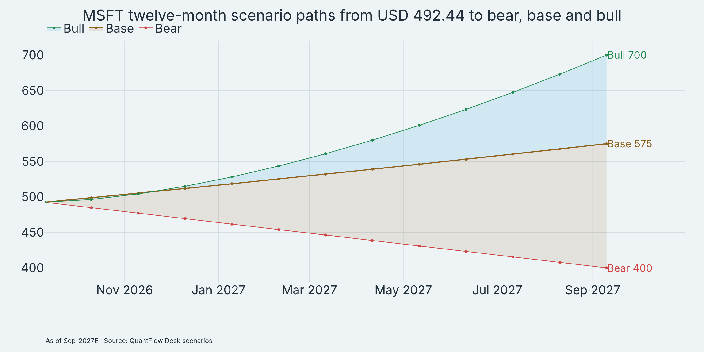

# QuantFlow

A quantitative-research super-agent harness: deep-exploration agents wired directly
into a local quant stack (market data, factors, backtests, portfolio construction)
and a multi-format report engine — ask for stock ideas, evidence-backed research,
and investment-committee style reports.



> **Fork note:** QuantFlow is forked from
> [**DeerFlow**](https://github.com/bytedance/deer-flow) by ByteDance (the 2.0
> super-agent harness: sub-agents, skills, memory, sandboxes). All harness credit
> goes upstream; this repo layers a quant-research desk on top. For the generic
> framework docs, start with
> [upstream README](https://github.com/bytedance/deer-flow/blob/main/README.md).

## What's different in this fork

- **alpha_engine MCP integration** (local stdio server, wired via
  `extensions_config.json` — see "Quant MCP servers" below; 17 tools
  catalogued in `config/quant_tools.yaml` and machine-checked by
  `scripts/validate_quant_tools.py`), dealt out to desk agents per tool:
  - *Data, survivorship-bias-free*: `engine_status` (freshness first),
    `get_price_history`, `get_latest_quotes`, `list_instruments`,
    `universe_members_as_of` (point-in-time S&P membership, mandatory for
    any historical selection), `cross_section_returns` (whole-universe
    breadth + concentration), `refresh_data` (quant-analyst only).
  - *Factors & signals*: `get_factor_history` (FF/AQR/JKP/universe factors),
    `run_factor_analysis` (IC + quantile tearsheets, builtin or DSL),
    `ml_signal_scores` (walk-forward, no look-ahead).
  - *Backtests*: `run_momentum_backtest`, `run_param_sweep` (CUDA grid
    search over lookback × top_n).
  - *Portfolio*: `optimize_portfolio` (max-Sharpe / HRP / Black-Litterman /
    equal-weight), `attribute_portfolio` (factor attribution),
    `brinson_attribution` (allocation/selection/interaction vs benchmark),
    `portfolio_risk_decomposition` (factor vs idiosyncratic vol).
  - *Reports*: `render_report` — interactive HTML tearsheets
    (`backtest` | `factor` | `single_name` equity note | `portfolio`
    review) in the QuantFlow identity (`quantflow-dark`/`light`,
    `ledger-dark`/`light`), with `png_dir` PNG export feeding print
    reports and an `intro` narrative lead-in.
- **report-forge MCP integration** (host-side stdio server, ~30 tools):
  one-source reports rendered via Quarto to HTML / PDF (Typst) / pdf-web /
  DOCX — scaffold → write → gate → publish, with infographic covers
  (verdict band, key-point cards, 3-scenario strip), `rf-showtable`
  spreadsheet tables, native Exhibit numbering, provenance-burned charts,
  and mechanical quality gates that refuse to ship bad exhibits.
  16 templates: 8 base (`standard`, `memo`, `whitepaper`, `modern`,
  `studio`, `portfolio-light/dark`, `bespoke`) + 8 domain briefs
  (`earnings-recap`, `sector-outlook`, `thematic-deepdive`,
  `macro-outlook`, `quant-factor-brief`, `technical-brief`,
  `esg-sustainability`, `crypto-digital`). Code execution
  (`reportforge_run_code`), static chart export, asset ingestion, and
  project inspection included — see
  `docs/plans/2026-09-01-reportforge-native-flexibility.md`.
- **kizonlp MCP integration**: financial NLP feeding the news/document
  analysts — `fin_sentiment` (transformer tone scoring), `zero_shot_classify`
  (guidance/risk/forward-looking labels), `summarize`, `extract_keyphrases`,
  `pdf_text` (earnings releases, filings, transcripts).
- **quant-desk skill** (`skills/custom/quant-desk/SKILL.md`): a CIO-style
  evidence-first workflow — frame the brief, gather evidence in parallel,
  bull-vs-bear debate, risk-manager veto, then a sourced synthesis. Research
  only, never financial advice. Specialist roster: `quant-analyst`
  (owns every number), `technical-analyst` (setups, levels, regimes),
  `news-analyst` (dated catalysts + sentiment), `earnings-analyst`
  (print vs consensus, guidance, call signals), `sector-researcher`
  (peer comps, cycle position), `macro-analyst` (rates/FX/commodities,
  scenario math), `thematic-analyst` and `demand-analyst` (theme exposure,
  TAM-with-math), `document-analyst` (attached files), `bull/bear-researcher`
  (adversarial debate with recorded demotions), `risk-manager` (caps,
  concentration, vol budgets). Reader-facing output is always branded
  `QuantFlow Research` — never upstream names.
- **QuantFlow personalization**: full UI rebrand plus a theme-aware
  digital-rain workspace backdrop (toggleable, respects
  `prefers-reduced-motion` and stays off under browser automation).
- **More model choices**: `config.example.yaml` shows the OpenAI-compatible
  gateway pattern, so you can add Meta's Muse Spark family via the Meta Model
  API alongside the Qwen / GLM / DeepSeek / Kimi examples — see "Muse models"
  below.

## Quick start

```bash
git clone https://github.com/Kizo07/quantflow.git
cd quantflow
make setup        # interactive wizard (recommended first run)
make doctor       # verify configuration and system requirements
make install      # frontend + backend + hooks
make dev          # all services with hot-reloading
```

Production instead: `make up` (Docker, unified endpoint `http://localhost:2026`).
Background runs: `make dev-daemon` / `make start-daemon`; `make stop` to end them.

Configuration lives in `config.yaml` (generated from `config.example.yaml` via
`make config`) plus `.env` for keys — both are gitignored and never committed.
After editing the example, merge with `make config-upgrade`. `make check`
verifies prerequisites.

## Quant MCP servers

`extensions_config.json` is local-only (gitignored). Copy the template, then
enable the quant servers with your own paths:

```bash
cp extensions_config.example.json extensions_config.json
```

The template already contains disabled `alpha_engine`, `kizonlp`, and
`reportforge` entries: replace the `/path/to/...` placeholders with your
checkouts (`alpha_engine` sources, `report-forge/.venv`), set
`"enabled": true` for the ones you run, and restart the gateway. Docker
(`make up`, `make docker-start`) auto-creates `extensions_config.json` from
the template when it is missing.

## Muse models

Nothing Muse-specific ships enabled: add one entry under `models:` in your
`config.yaml`, following the OpenAI-compatible examples in
`config.example.yaml`, and put the key in `.env` (never in the YAML):

```yaml
models:
  - name: muse-spark-1.3-contributor
    display_name: Muse Spark 1.3
    use: deerflow.models.patched_openai:PatchedChatOpenAI
    model: muse-spark-1.3-contributor
    api_key: $MODEL_API_KEY
    base_url: https://api.meta.ai/v1
    context_window: 800000   # total prompt + completion capacity
    supports_reasoning_effort: true
```

(`max_tokens` is the per-call *output* cap — do not set it to the context
size.) Model metadata usually hot-reloads; restart the gateway if the new
model doesn't show up.

## The quant desk

Ask things like *"find 10 momentum names with fresh catalysts"* or
*"build a defensive portfolio from these picks"*. Behind the prompt:

1. **Frame** — the question becomes a brief (universe, horizon, constraints).
2. **Evidence** — `quant-analyst` screens/ranks (factors, ML scores, backtests),
   `news-analyst` adds dated catalysts, technicians cover setups.
3. **Debate** — `bull-researcher` vs `bear-researcher` argue the shortlist;
   weak names are demoted with reasons on record.
4. **Risk gate** — `risk-manager` enforces caps, concentration and vol budgets.
5. **Synthesis** — one ranked report with evidence, demotions, risk dashboard,
   and caveats, rendered through report-forge when a formatted deliverable
   is needed.

Data freshness first: the desk checks `engine_status` and refreshes the local
store (`refresh_data`, quant-analyst only) before trusting a screen.

## Flagship reports

Full investment-committee deliverables this stack has produced —
desk research through alpha_engine, typeset by report-forge (PDF + HTML,
verdict call with bear/base/bull scenarios):

- **MSFT 12-month outlook** (14pp, light edition, Sep 2026) — OVERWEIGHT,
  Base $575 (+16.8% from $492.44), 16 exhibits. Full report in-repo:
  [PDF](docs/showcase/msft-12m-outlook/index.pdf) ·
  [HTML](docs/showcase/msft-12m-outlook/index.html).
- **GOOGL 12-month outlook** (26pp, dark + light editions) — OVERWEIGHT,
  Base $415 (+23%), 25 charts.
- **META 12-month outlook** (24pp) — Base $720, 25 charts.
- **NVDA 12-month outlook** (22pp), **MU deep-dive** (30pp).

Cover with verdict band, key-point cards and scenario strip, all on page 1:



Exhibit-led body — scenario fan with labeled terminal values, provenance
burned into every chart:



Ask the desk for the next one the same way: *"produce a full 12-month
outlook on TICKER"*.

## Repo map

- `config.example.yaml` / `config.yaml` — models, token budgets, tool policy.
- `config/quant_tools.yaml` — alpha_engine tool catalog per desk agent.
- `extensions_config.example.json` / `extensions_config.json` (gitignored) —
  MCP servers incl. disabled `alpha_engine`, `kizonlp`, `reportforge` entries.
- `skills/custom/quant-desk/` — the desk playbook; `skills/public/` — upstream skills.
- `scripts/validate_quant_tools.py` — keeps the tool catalog in sync with the engine.
- `docs/plans/` — design notes (report-forge flexibility, remediation logs).
- `backend/` + `frontend/` — the harness itself (upstream DeerFlow 2.0).

## Security notice

This fork adds capabilities upstream's hardening notes don't cover:

- **Host code execution is on by default locally.** `reportforge_run_code` /
  `reportforge_run_file` run with your user permissions by design (see the
  flexibility plan). Treat prompts and report inputs as untrusted, and set
  `REPORTFORGE_EXEC=off` for any shared, CI, or public deployment.
- **Do not publicly host this stack as-is.** It is built for a single local
  operator: MCP servers, sandbox mounts, and the gateway assume localhost
  trust. Review upstream's security recommendations before exposing anything.
- **Keys stay in `.env`** (gitignored, never committed). Session imports
  (`POST /api/threads/import`) sanitize uploads to plain human/AI transcript —
  tool calls, ids, and reasoning payloads are dropped — but never import
  files from sources you don't trust.

## Upstream & license

Harness core: [bytedance/deer-flow](https://github.com/bytedance/deer-flow)
(MIT — see [LICENSE](./LICENSE)). Quant layers (desk skill, tool catalog,
MCP wiring, plans) are this fork's additions. Upstream docs in other languages
(`README_zh/ja/fr/ru.md`) describe the unmodified framework.
