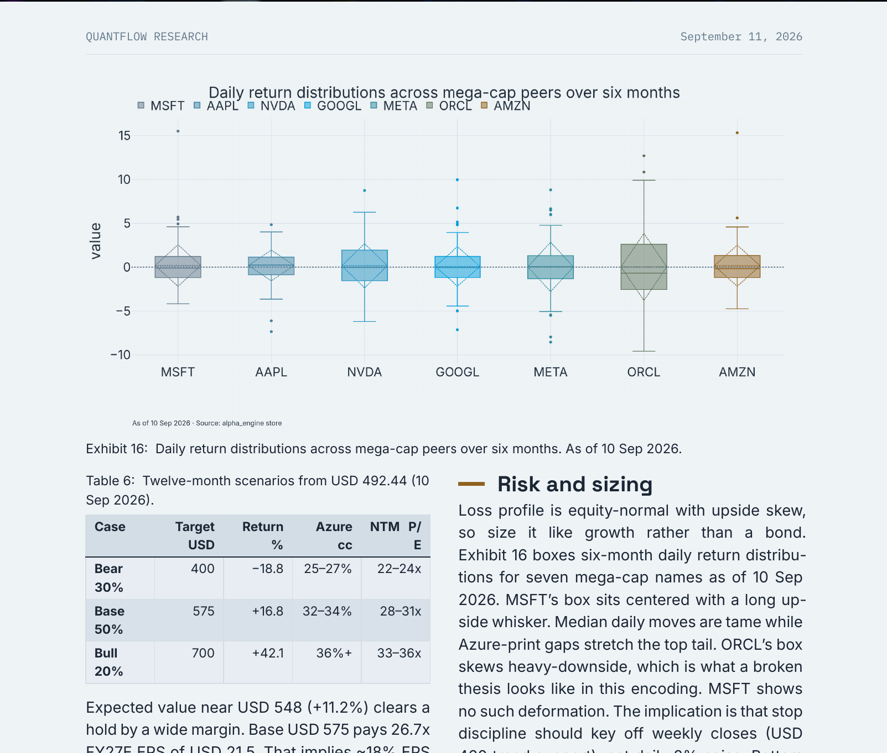

# QuantFlow

A quantitative-research super-agent harness. Deep-exploration agents wired
directly into a local quant stack — market data, factors, backtests,
portfolio construction — with an evidence-backed research ledger and a
multi-format report engine. Ask for stock ideas, sourced research, and
investment-committee style reports.


> Forked from [DeerFlow](https://github.com/bytedance/deer-flow) by ByteDance
> (the 2.0 super-agent harness: sub-agents, skills, memory, sandboxes). All
> harness credit goes upstream; this repo layers a quant-research desk on
> top. For the generic framework docs, see the
> [upstream README](https://github.com/bytedance/deer-flow/blob/main/README.md).

## Features

**Quant desk** (`skills/custom/quant-desk/`) — a CIO-style evidence-first
workflow: frame the brief, gather evidence in parallel, run a recorded
bull-vs-bear debate with demotions, pass a risk-manager veto, then compile
a sourced synthesis. Research only, never financial advice. Eleven
specialists on call: `quant-analyst` (owns every number), `technical-`,
`news-`, `earnings-analyst`, `sector-researcher`, `macro-`,
`thematic-`, `demand-`, `document-analyst`, plus `bull`/`bear-researcher`
and `risk-manager`. Reader-facing output is always branded
`QuantFlow Research`.

**Market data & research engine** (alpha_engine MCP, local stdio) — 17 tools
catalogued in `config/quant_tools.yaml` and dealt out per desk agent
(machine-checked by `scripts/validate_quant_tools.py`): freshness-first
`engine_status`; S&P 500 prices, quotes, and whole-universe breadth;
point-in-time membership (`universe_members_as_of`, mandatory for any
historical selection); FF/AQR/JKP factor history, IC/quantile factor
analysis, and walk-forward ML signal scores; momentum backtests with costs
and purge/embargo plus CUDA parameter sweeps; max-Sharpe/HRP/Black-Litterman
optimization, factor attribution, Brinson attribution, and risk
decomposition; interactive HTML tearsheets (`render_report`) in the
QuantFlow identity with PNG export for print.

**Flagship report publishing** (report-forge MCP, host-side stdio) —
one-source reports rendered via Quarto to HTML / PDF / DOCX: scaffold →
write → gate → publish, with infographic covers (verdict band, key-point
cards, scenario strip), spreadsheet tables, native Exhibit numbering,
provenance-burned charts, and mechanical quality gates that refuse to ship
bad exhibits. 16 templates (8 base + 8 domain briefs) plus a `bespoke`
escape hatch; code execution, static chart export, and asset ingestion
included.

**Financial NLP** (kizonlp MCP) — transformer tone scoring
(`fin_sentiment`), zero-shot guidance/risk/forward-looking labels,
summarization, keyphrase extraction, and PDF text (releases, filings,
transcripts) feeding the news/document analysts.

**Research Knowledge Plane**
(`backend/packages/harness/deerflow/knowledge/`) — experiments, failures,
and evidence as shared, queryable state instead of chat memory. First-class
experiments with family/execution identity hashes, SHA-256
content-addressed artifacts (S3 API, MinIO for local dev), dataset
vintages, assumptions, and hybrid retrieval (structured + lexical +
vector + failure channels, RRF fusion) behind `knowledge_search` /
`knowledge_get` tools with bootstrap middleware. Sectioned exit gate:
recall@10 ≥ 0.83, failure-recall@10 ≥ 0.82 on the committed eval fixture.
Harness only — knowledge *content* stays local and gitignored.

**Workspace & models** — full UI rebrand with a toggleable theme-aware
digital-rain backdrop (respects `prefers-reduced-motion`); OpenAI-compatible
model gateway, so the Muse Spark family, Qwen, GLM, DeepSeek, and Kimi all
plug in through `config.example.yaml` (see Models below).

## Quick start

```bash
git clone https://github.com/Kizo07/quantflow.git
cd quantflow
make setup        # interactive wizard (recommended first run)
make doctor       # verify configuration and system requirements
make install      # frontend + backend + hooks
make dev          # all services with hot-reloading
```

Production instead: `make up` (Docker, unified endpoint
`http://localhost:2026`). Background runs: `make dev-daemon` /
`make start-daemon`; `make stop` to end them.

Configuration lives in `config.yaml` (generated from `config.example.yaml`
via `make config`) plus `.env` for keys — both gitignored, never committed.
After editing the example, merge with `make config-upgrade`. `make check`
verifies prerequisites.

## The quant desk

Ask things like *"find 10 momentum names with fresh catalysts"* or
*"build a defensive portfolio from these picks"*. Behind the prompt: frame
the brief → parallel evidence gathering (screens, catalysts, setups) →
bull-vs-bear debate with recorded demotions → risk-manager veto on caps,
concentration, and vol budgets → one ranked report with evidence, demotions,
risk dashboard, and caveats, rendered through report-forge when a formatted
deliverable is needed. Data freshness first: the desk checks
`engine_status` and refreshes the local store before trusting a screen.

## MCP servers

| Server   | Provides | Source |
|----------|----------|--------|
| `alpha_engine` | 17 quant tools: data, factors, backtests, portfolio, tearsheets | sibling checkout (`../alpha_engine`) |
| `reportforge` | Quarto report pipeline, ~30 tools | host-side stdio server |
| `kizonlp` | sentiment, classification, summarization, PDF text | host-side stdio server |

`extensions_config.json` is local-only (gitignored). Copy the template and
enable the servers with your own paths:

```bash
cp extensions_config.example.json extensions_config.json
```

Replace the `/path/to/...` placeholders, set `"enabled": true` for the
ones you run, and restart the gateway. Docker auto-creates the file from
the template when it is missing.

## Models

Nothing model-specific ships enabled: add one entry under `models:` in
your `config.yaml`, following the OpenAI-compatible examples in
`config.example.yaml`, with the key in `.env` (never in the YAML):

```yaml
models:
  - name: muse-spark-1.3-contributor
    display_name: Muse Spark 1.3
    use: deerflow.models.patched_openai:PatchedChatOpenAI
    model: muse-spark-1.3-contributor
    api_key: $MODEL_API_KEY
    base_url: https://api.meta.ai/v1
    context_window: 800000   # total prompt + completion capacity
    supports_reasoning_effort: true
```

(`max_tokens` is the per-call *output* cap — do not set it to the context
size.) Metadata usually hot-reloads; restart the gateway if the new model
doesn't show up.

## Research Knowledge Plane

```bash
make -C backend test-knowledge   # unit suite (fake stores, no services needed)
make -C backend eval-knowledge   # retrieval-eval fixture + committed exit gate
cp deploy/knowledge/minio.env.example deploy/knowledge/minio.env  # then edit secrets
docker compose -f deploy/knowledge/docker-compose.minio.yml up -d
```

Only the harness ships. Sources, artifact bytes, dataset stores, and
credentials (`kb_sources/`, local artifact roots, `data/`, `*.env`) are
gitignored — see `.gitignore`.

## Showcase

Investment-committee deliverables this stack has produced — desk research
through alpha_engine, typeset by report-forge (PDF + HTML, verdict call
with bear/base/bull scenarios):

- **MSFT 12-month outlook** (14pp, Sep 2026) — OVERWEIGHT, Base $575
  (+16.8%), 16 exhibits. In-repo: [PDF](docs/showcase/msft-12m-outlook/index.pdf) ·
  [HTML](docs/showcase/msft-12m-outlook/index.html).
- **GOOGL 12-month outlook** (26pp, dark + light) — OVERWEIGHT, Base $415.
- **META 12-month outlook** (24pp) — Base $720. **NVDA outlook** (22pp),
  **MU deep-dive** (30pp).




Ask the desk for the next one the same way: *"produce a full 12-month
outlook on TICKER"*.

## Repo map

| Path | Contents |
|------|----------|
| `config.example.yaml` / `config.yaml` | models, token budgets, tool policy |
| `config/quant_tools.yaml` | alpha_engine tool catalog per desk agent |
| `extensions_config.example.json` | MCP server template (local copy gitignored) |
| `skills/custom/quant-desk/` | desk playbook; `skills/public/` — upstream skills |
| `scripts/validate_quant_tools.py` | keeps the tool catalog in sync with the engine |
| `docs/plans/` | design notes (report-forge flexibility, remediation logs) |
| `docs/showcase/` | flagship report artifacts |
| `backend/` + `frontend/` | the harness itself (upstream DeerFlow 2.0) |
| `backend/…/deerflow/knowledge/` | Knowledge Plane API, schema, retrieval, eval |
| `backend/tests/test_knowledge_*.py` | harness-side knowledge tests |
| `deploy/knowledge/` | MinIO compose for local artifact storage |

## Security notice

This fork adds capabilities upstream's hardening notes don't cover:

- **Host code execution is on by default locally.** `reportforge_run_code`
  runs with your user permissions by design. Treat prompts and report
  inputs as untrusted, and set `REPORTFORGE_EXEC=off` for any shared, CI,
  or public deployment.
- **Do not publicly host this stack as-is.** It is built for a single
  local operator: MCP servers, sandbox mounts, and the gateway assume
  localhost trust. Review upstream's security recommendations before
  exposing anything.
- **Keys stay in `.env`** (gitignored, never committed). Session imports
  (`POST /api/threads/import`) sanitize uploads to plain human/AI
  transcript — tool calls, ids, and reasoning payloads are dropped — but
  never import files from sources you don't trust.

## Upstream & license

Harness core: [bytedance/deer-flow](https://github.com/bytedance/deer-flow)
(MIT — see [LICENSE](./LICENSE)). Quant layers (desk skill, tool catalog,
MCP wiring, Knowledge Plane, plans, showcase) are this fork's additions.
Upstream docs in other languages (`README_zh/ja/fr/ru.md`) describe the
unmodified framework.
